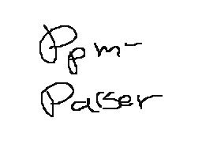

🗃 :code:`para`
====================

What?
-----

A decoder and utility for the Flipnote Studios :code:`.ppm` animation format.

Why this implementation over `the original <https://github.com/Flipnote-Collective/ppm-parser>`_?
-------------------------------------------------------------------------------------------------

This implementation is

- `SIGNIFICANTLY faster <#speed>`_,
- implemented in safe Rust (a language with strict type-checking!),
- and being actively updated.

Speed
^^^^^

In a two-hundred-forty-four frame :code:`.ppm` benchmark running the command
:code:`$ para ./benchmark.ppm gif benchmark.gif` on a twelve-core,
twenty-four-thread Ryzen 9 processor, para took an average of 566.9893 milliseconds,
while ppm-parser took an average of 50.4171397 seconds.

Running the command :code:`$ para ./benchmark.ppm 0 benchmark.png` on a twelve-core,
twenty-four-thread Ryzen 9 processor, para took an average of 8.6251 milliseconds,
while ppm-parser took an average of 358.2232 milliseconds.

Rust versus Python isn't very fair, however, this benchmark shows the speed improvements
that para brings to the table.

Things To Come
--------------

- Support for other formats (namely :code:`.kwz`)
- Optimizations here and there
- Friendlier CLI
- Possible GUI

Getting up and Running
----------------------

Installation
^^^^^^^^^^^^

Prebuilt binaries for x86_64-based Linux systems and Windows are available in the
`releases <https://github.com/Usugata/para/releases/latest>`_. If you are using
a different operating system or architecture such as macOS, you'll have to build and
install the tool yourself!

.. code-block:: shell

  $ cargo install --git https://github.com/Usugata/para --branch main

If you are building and installing yourself, you must have
`Rust <https://www.rust-lang.org/>`_ installed!

Usage
^^^^^

.. code-block:: shell

  usage:  para <in> <index option> <out>
  index options:
          gif
          thumb
          dump
          integer(u16)

Examples
^^^^^^^^

- :code:`$ para ./example.ppm 23 example.png` will output the twenty-fourth frame
  of :code:`example.ppm` to :code:`example.png`
- :code:`$ para ./example.ppm thumb example.png` will output the thumbnail of
  :code:`example.ppm` to :code:`example.png`
- :code:`$ para ./example.ppm dump example.json` will output the metadata of
  :code:`example.ppm` to :code:`example.json`
- :code:`$ para ./example.ppm gif example.gif` will output :code:`example.ppm`
  to :code:`example.gif`

Prebuilt Binaries
"""""""""""""""""

Prebuilt binaries for the latest release may or may not be found
`here <https://github.com/Usugata/para/releases/latest>`_.

Credits
-------

- `jaames <https://github.com/jaames>`_ for completing PPM reverse-engineering and
  writing the `original <https://github.com/Flipnote-Collective/ppm-parser>`_ implementation.
- `bricklife <http://ugomemo.g.hatena.ne.jp/bricklife/20090307/1236391313>`_,
  `mirai-iro <http://mirai-iro.hatenablog.jp/entry/20090116/ugomemo_ppm>`_,
  `harimau_tigris <http://ugomemo.g.hatena.ne.jp/harimau_tigris>`_, and other members
  of the Japanese Flipnote community who started reverse-engineering the PPM format
  almost as soon as the app was released.
- Midmad and WDLMaster for identifying the adpcm sound codec used.
- `steven <http://www.dsibrew.org/wiki/User:Steven>`_ and
  `yellows8 <http://www.dsibrew.org/wiki/User:Yellows8>`_ for the PPM documentation on DSiBrew.
- `PBSDS <https://github.com/pbsds>`_ for more PPM reverse-engineering, as well as
  writing `hatenatools <https://github.com/pbsds/Hatenatools>`_

License
-------

`MIT License <./LICENSE>`_
